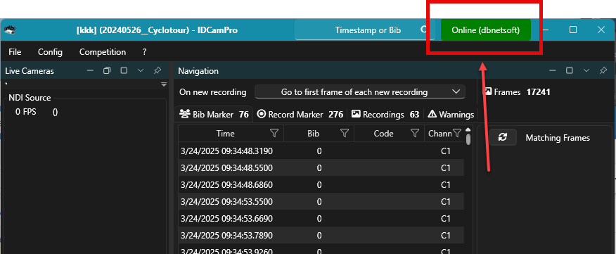

# Licensing

For the most part, our licenses are time-limited licenses, e.g. one year. After that period, the license will not work anymore.&#x20;

All our software can be used without a license in demo mode. This mode let you try out all the features, but the software will close itself after a couple of minutes without prior notice.&#x20;

## License Types

* License File\
  These _\*.lic_ files need to be copied into the program directory, usually `c:\program files\dbnetsoft\<productname>`
* USB-Dongles\
  These special dongles need to be attached to the computer during operation
* Online Activation\
  A key code must be entered on a single computer and then renders this computer activate - no more than one computer can be activated at a single time

## Checking license

Licensing works very similar across all our software products. You can check the state of the license quickly at the top right corner:&#x20;

<figure><figcaption></figcaption></figure>

Green means licensed, orange means demo mode or license error. More information can be obtained when clicking on the licensing button.&#x20;

The license information windows will show you all the relevant licneses available and installed:&#x20;

<figure><figcaption></figcaption></figure>

## Online Activation

Click on the licensing button in the top right corner - this will bring up the License Information window. In the section _Online Activation_, enter your license code and click _Activate_ button.&#x20;

For the activation to work, the computer needs to be connected to the internet. After activation, it will remain activated for 7 days. Only after that, the system needs to be online again to renew activation.


When you expect to have no internet connection at the event, make sure to activate the computer shortly before leaving for the event. This way you have 7 days without the need to re-activate.&#x20;

