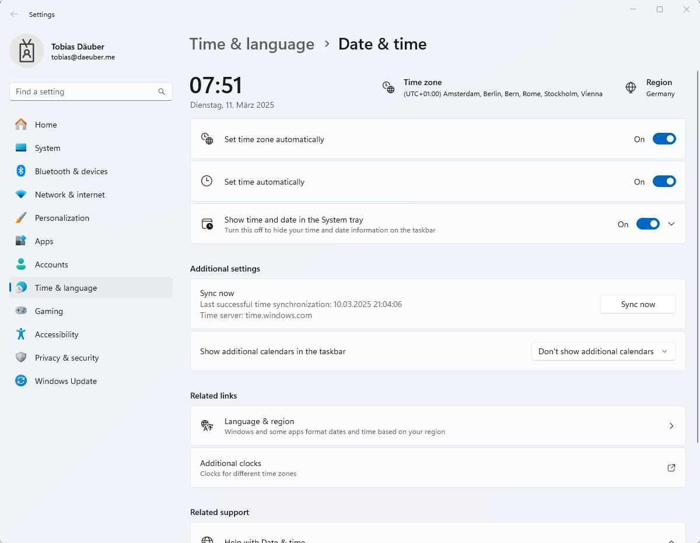

# Time Sync

All of your equipment should have the same time. Easiest is if you have timing systems that sync themselves to GPS and computers to NTP servers.&#x20;

## Syncing computers

### Windows

Computers are usually well synced to an NTP server from Microsoft. In case they are off, you can always _right click_ on the time in the lower right corner - _Adjust Time & Date_ - _Sync now_ button. \

<figure><figcaption></figcaption></figure>

### dbnetsoft Software

Each dbnetsoft software follows the same syncing strategy, sometimes deviating from it (e.g. Photofinish.NET). In either case, the software cannot sync Windows directly without having Administrator privileges (which is what you want to avoid). There the software usually only syncs itself (process) and uses this internal time.&#x20;

You can click on _?_ - _About_ - _Time/Sync_ tab and see the status of the sync:

<figure><figcaption></figcaption></figure>

To the left you see the time of the computer and it's deviation from internet time. A value below .5s is recommended. If you want to sync your comptuer, you can clic kthe _Sync to NTP_ button with the shield, asking for administrator approval and then starting a script to sync windows. It is basically doing the same as the _Sync now_ button in the windows _Adjust Time/Date_ settings page.&#x20;

To the right you see the process time of the current software and how much it is set that differs from windows. Usually, the syncing happens automatically from the respective software. You can override it and tweak it here, but it will resync later on anyway.&#x20;

## &#x20;Syncing timing devices


Makre sure to have the **leap second** setting correct on your timing devices that needs manual adjustment.


## Checking sync

A good way to check your syncing is to open [https://time.gov/](https://time.gov/) in your browser. This website will tell you the deviation of your system as well as the current time in general.

<figure><figcaption></figcaption></figure>
